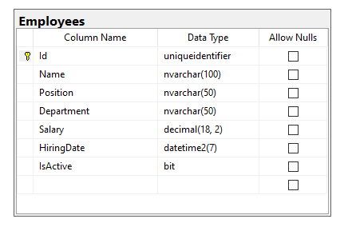

# TechLead_SGE

## Contexto

Proyecto prueba de desarrollo: Creación de una API de tipo Rest en Net 8 consumida desde un FrontEND en React.

<b> Prueba Desarrollada Por: Jhon Alejandro Sandoval Miranda </b> 

## Estructura Principal de Archivos

```bash
└─ TechLead_SGE
    ├─ TechLead_SGE.Client
    │   ├─ public
    │   │   └─ assets
    │   │      ├─ backgrounds
    │   │      ├─ icons
    │   │      └─ logos
    │   └─ src
    │       ├─ Components
    │       │  ├─ Employees 
    │       │  ├─ Forms 
    │       │  ├─ Home
    │       │  └─ Shared
    │       ├─ Interfaces
    │       ├─ Layouts
    │       ├─ Models
    │       └─ Services
    ├─ TechLead_SGE.Server
    │  ├─ Classes
    │  │  └─ Logic
    │  │      ├─ Common
    │  │      └─ Custom
    │  └─ Controllers
    ├─ TechLead_SGE.Server.BL
    │  ├─ Classes
    │  ├─ Repositories
    │  │  ├─ Implements
    │  │  └─ Interfaces
    │  └─ Services
    │     ├─ Implements
    │     └─ Interfaces
    ├─ TechLead_SGE.Server.Data
    │  ├─ DBContext
    │  └─ Migrations
    ├─ TechLead_SGE.Server.Domain
    ├─ TechLead_SGE.Server.UnitTest
    │  ├─ Contexts
    │  ├─ DTOS
    │  ├─ Interfaces
    │  └─ Models
    └─ TechLead_SGE.Server.Utilities
       ├─ Classes
       └─ Models
```

Cada una de estas carpetas principales corresponde a proyectos separados donde se encuentra segmentado por una modularización. De igual manera, en cada ruta se encuentra una breve explicación.

La distribución se realizó de la siguiente forma:

* FRONT-END: 
    - ./TechLead_SGE.Client
* BACK-END: 
    - ./TechLead_SGE.Server
    - ./TechLead_SGE.Server.BL
    - ./TechLead_SGE.Server.Data
    - ./TechLead_SGE.Server.Domain
    - ./TechLead_SGE.Server.Utilities
* Pruebas Unitarias:
    - ./TechLead_SGE.Server.UnitTest

## Inicialización de los proyectos

Se debe tener en cuenta que para arrancar los proyectos se deben tener previamente instaladas algunas tecnologías como lo son:

- NodeJS V22.15.0.
- NPM V11.3.0.
- React 19.00.
- Net 8.
- EF 9.0.4.
- SQL SERVER - SSMS 18.

## Ejecución de los Proyectos.

### .CLIENT

* Se debe inicialmente ubicarse sobre ./TechLead_SGE.Client y ejecutar el siguiente comando para instalar los paquetes de npm respectivos.

```bash
npm i
```

* Para iniciar el proyecto se debe tener en cuenta que se iniciar el proyecto de la API y a su vez el de angular con la siguiente linea: 

```bash
npm run dev
```
### .SERVER

Basta con abrir la solución y ejecutarla, teniendo en cuenta previamente que se debe realizar un ajuste a la cadena de conexión para permitir la creación de la BD con unos datos de pruebas.

#### Conexión con BD
Para conectarse y crear una base de datos desde 0 a través de migraciones se debe modificar el appsettings.json del proyecto TechLead_SGE.Server, más exactamente la siguiente linea:

```bash
"ConnectionStrings": {
  // CNX_BD DESARROLLO
  "CNX_BD": "Data Source=DataBase_Name;Database=TechLead_SGE_BD;Trusted_Connection=True;TrustServerCertificate=True;Application Name=TechLead_SGE.Server;"
}
```

Allí se reemplaza 'DataBase_Name' por el nombre del servidor local o externo de la base de datos, en cuyo caso debe ser gestionado a través de el SGBD de SQLSERVER (SSMS).


## Diseño Proyecto

### FRONT-END
A continuación se presenta el diseño del FrontEnd del Proyecto.


### BACK-END
A continuación se presenta la imagen dela documentación de la API del BackEnd.


También se presenta el diseño de la tabla de la BD.


## Pruebas Unitarias

### BACK-END
A continuación se presenta la imagen de las pruebas unitarias realizadas a los endpoints de la API.

